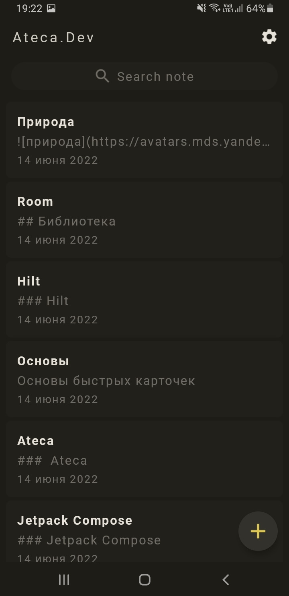
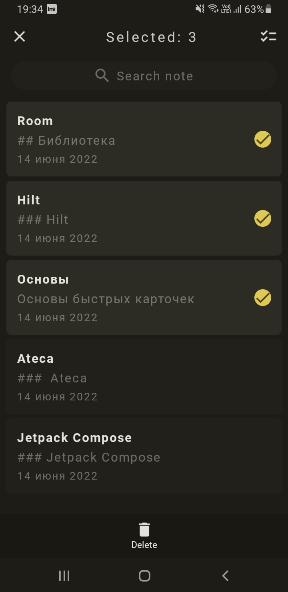
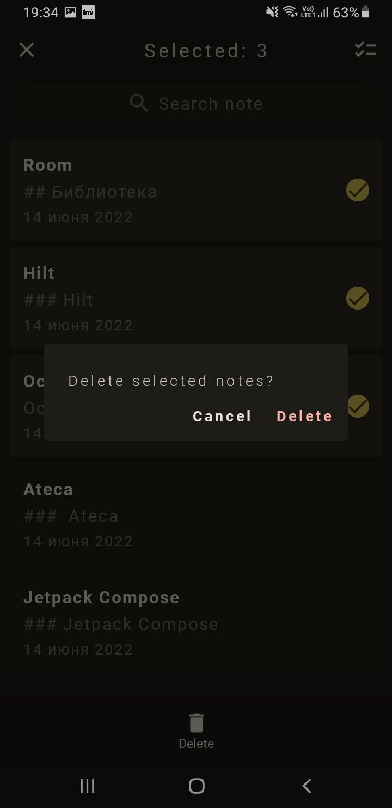
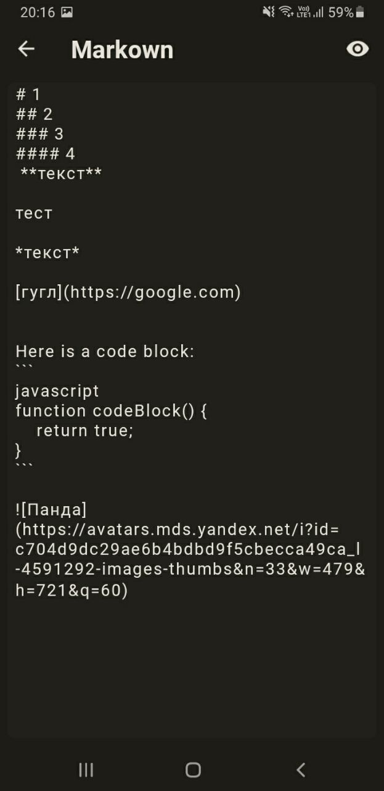
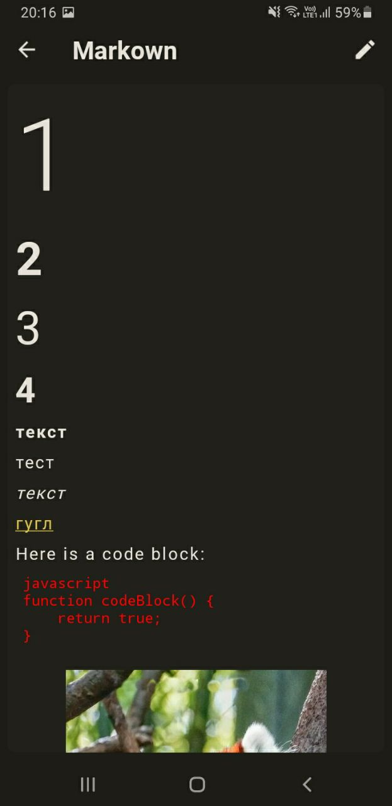

  

О приложении Ateca _[в разработке 🚧]_
==================

## Основная идея быстрые заметки

В основе идеи лежит отличный метод сохранения мыслей и знаний Zettelkasten (коробка с заметками, картотека и т.д.).
Разработал методику немецкий социолог Николас Луман.

### Основные критерии методики

#. Заметка должна содержать только одну мысль, а не их совокупность,
#. быть автономной, т.е. самодостаточной и понятной,
#. и иметь ссылку на первоисточник. Это полезно, для дальнейшего написания книги, научной статьи, дипломной работы.

## Готовый функционал

Экран для формирования списка, поиск заметок по тексту, удаление и создание заметок

  

Второй экран для ведения заметок и также режим просмотра

 

> Реализован почти весь базовый синтаксис Markdown

### Гифки

 

## Используемый стек

Хранение данных [Room](https://developer.android.com/jetpack/androidx/releases/room) + [DataStore](https://developer.android.com/topic/libraries/architecture/datastore)

Визуальный интерфейс [Jetpack Compose](https://developer.android.com/jetpack/compose)

Внедрение зависимостей [Hilt](https://developer.android.com/training/dependency-injection/hilt-android)

Для асинхронной работы [Coroutines](https://developer.android.com/kotlin/coroutines) + [Flow](https://developer.android.com/kotlin/flow)

Синтаксический анализатор [Flexmark](https://github.com/vsch/flexmark-java)

## Архитектура

Model-View-Intent ([MVI](https://habr.com/ru/company/tinkoff/blog/338558/)). Проще  выполнять асинхронные задачи,
легко просматривается весь путь получения данных. Удобно агрегировать модули, позволяя легче добавлять новый функционал.
Код выглядит более организованным и его проще понять.

## Планы на будущее

#. Поддержка дополнительной разметки Markdown в том числе и кастомной
#. При добавлении карточки подсвечивать подсказки
#. Кнопки над клавиатурой для быстрого ввода различной разметки
#. Вставка файлов из файловой системы пользователя
#. Дополнительная и более детальная настройка ввода разметки пользователем
#. Бимодальный режим редактора
#. Хранение заметок в облаке и их совместное использование
#. Визуализация графа заметок

## UI

Компоненты пользовательского интерфейса разработаны в соответствии с [Material 2 guidelines](https://material.io/)
полностью с использованием [Jetpack Compose](https://developer.android.com/jetpack/compose).

## Лицензия

Сейчас в Android распространяется на условиях лицензии Apache (версия 2.0). Посмотрите
[лицензию](LICENSE) для получения дополнительной информации.
